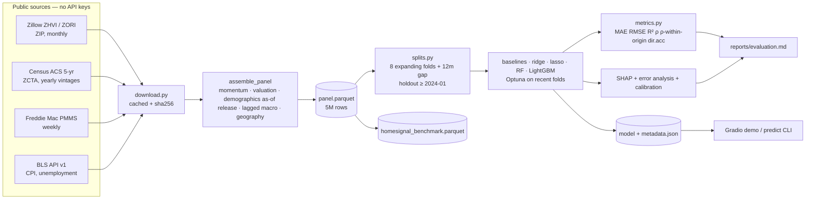

# HomeSignal

Predicts the **12-month-forward percent change in home values for every U.S. ZIP code**, using only
information that was publicly available at the time of each prediction. Built end-to-end from free,
keyless public data (Zillow Research, Census ACS, Freddie Mac, BLS) with a leakage-tested feature
pipeline, an expanding-window backtest with a 12-month gap, an untouched holdout, SHAP explanations,
and a small Gradio demo.

> **Educational project. Not financial, investment, lending or appraisal advice.**

## Headline results (holdout, touched once)

| Model | MAE (pp) | RMSE (pp) | R² | ρ pooled | ρ within origin | Dir. acc. |
|---|---|---|---|---|---|---|
| **Final LightGBM (tuned)** | 5.84 | 7.34 | -1.174 | 0.044 | 0.094 | 0.686 |
| Zero growth | 4.02 | 5.28 | -0.123 | — | — | 0.686 |
| Trailing 12m continues | 4.47 | 6.27 | -0.588 | 0.265 | 0.312 | 0.707 |
| Training mean | 5.77 | 7.15 | -1.061 | — | — | 0.686 |

Holdout = 157,605 ZIP-quarters at origins 2024-01 → 2025-06. **The final model does not beat the naive baselines on the holdout**: it is biased about +6 pp (it predicts 6–9 % growth in a period that delivered 1–3 %) because it learned the 2020–21 low-rate boom and extrapolated from macro features. On the 8-fold backtest (2016–2023) LightGBM beats every baseline on MAE (4.91 vs 5.33 for the training-mean baseline) and ranks ZIPs with within-origin Spearman 0.31 ± 0.16, but that ranking skill fell to ≈0.07 in 2022–2023 and to 0.09 on the holdout.

The honest summary: the model has real **ranking** skill across ZIPs (which areas will grow faster than
others) but, like every model and baseline here, it cannot predict the **market-wide level** of growth,
which dominates the error in regime years (2020–2022). Full tables with per-fold variation are in
[`reports/evaluation.md`](reports/evaluation.md); limitations in
[`reports/model_card.md`](reports/model_card.md).

## Architecture



## Quickstart

Requirements: Python 3.11, [uv](https://github.com/astral-sh/uv) (or pip), ~3 GB disk, ~8 GB RAM, a
normal laptop CPU. No API keys.

```bash
git clone https://github.com/Gariyuuu/homesignal && cd homesignal
make all          # setup → download (~2.5 GB) → build panel → backtests → tune → train → explain → export → report
make app          # Gradio demo at http://127.0.0.1:7860
make check        # ruff + mypy --strict + 33 offline tests (what CI runs)
```

Individual steps: `make download build backtest ablations tune train explain export report`.
Full run time on a 12-core laptop: about 45 minutes after the one-time download (panel 20 s, backtests ≈ 10 min, tuning ≈ 10 min, SHAP/error analysis ≈ 1 min).

Predict for one ZIP at one origin month, with the top contributing features:

```bash
.venv/bin/homesignal predict 78702 2025-06
```

## How it works

* **Target.** `(ZHVI[t+12] / ZHVI[t] − 1) × 100` on the raw (not seasonally adjusted) mid-tier ZHVI.
* **Features (46).** Momentum (1–36-month growth, volatility, drawdown), valuation (price-to-income,
  price-to-rent, value vs. state/metro median), ACS demographics assigned to the months each vintage was
  actually available, macro (mortgage rate, CPI, national + state unemployment, each with its publication
  lag), coarse geography (state, region, metro-size bucket; no raw identifiers).
  Every feature: [`docs/feature_dictionary.md`](docs/feature_dictionary.md).
* **Leakage control.** Documented risk-by-risk in [`docs/methodology.md`](docs/methodology.md) and
  enforced by [`tests/test_leakage.py`](tests/test_leakage.py), which scrambles all inputs after a cutoff
  and asserts every feature before it is unchanged.
* **Evaluation.** Quarterly origins 2013-03 → 2023-12 for the backtest (validation years 2016–2023, 12-month
  gap), holdout origins 2024-03 → 2025-06. Per-fold metrics always reported.
* **Models.** Zero / trailing-growth / national-mean baselines, ridge, lasso, random forest, LightGBM
  (+ 25-trial Optuna). Final model: LightGBM.
* **Tracking.** `models/experiments.jsonl` — one JSON record per run (config, commit, per-fold metrics).

## Repo map

```
configs/            data.yaml features.yaml evaluation.yaml model.yaml
src/homesignal/
  data/             download.py zillow.py acs.py bls.py freddie.py crosswalks.py
  features/         build.py (assemble_panel) lags.py demographics.py macro.py geography.py
  models/           dataset.py registry.py baselines.py train.py tune.py predict.py
  evaluation/       splits.py metrics.py backtest.py error_analysis.py export.py report.py
  explain/          shap_analysis.py
  cli.py tracking.py config.py
app/                app.py prepare_app_data.py README.md (Hugging Face Space card) requirements.txt
docs/               sources.md methodology.md feature_dictionary.md known_issues.md benchmark_handoff.md
reports/            evaluation.md model_card.md figures/ results/
tests/              offline unit + leakage + split + integration tests (synthetic data)
data/{raw,interim,processed}   git-ignored; rebuilt by `make download build`
models/             saved model, metadata JSON, experiment log, backtest predictions
```

## Data attribution and terms

* Home values and rents: **Zillow Research** (ZHVI, ZORI), <https://www.zillow.com/research/data/>.
  Raw files are not redistributed; they are downloaded at build time.
* Demographics: **U.S. Census Bureau**, American Community Survey 5-year estimates (public domain).
* Mortgage rates: **Freddie Mac** Primary Mortgage Market Survey, used unaltered with attribution.
* Unemployment and CPI: **U.S. Bureau of Labor Statistics** public API (public domain).

Details, URLs, licences and release-lag assumptions: [`docs/sources.md`](docs/sources.md).

## Status

Complete (v0.1, 2026-10-03): all Definition-of-Done items met; results are negative-to-modest and reported as such. Stretch goals (prediction intervals, rent target, map) not started.
