# Evaluation report

All numbers below are produced by `make all` (`homesignal backtest`, `train-final`, `explain`, `report`) and are
out-of-sample. Nothing is hand-edited. Target: 12-month-forward percent change in ZIP-level ZHVI (percentage points).

## Evaluation design

- Prediction origins: month-ends in months [3, 6, 9, 12] from 2013-03 (quarterly, to keep the laptop budget).
- Expanding-window backtest, one fold per validation year, 12-month gap between the last training origin and the first validation origin so no training target overlaps validation.
- Final holdout: origins from 2024-01 onward, touched exactly once by `train-final`.

| Fold | training origins | validation origins |
|---|---|---|
| val_2016 | ≤ 2015-03-01 | 2016-03-01 → 2016-12-01 |
| val_2017 | ≤ 2016-03-01 | 2017-03-01 → 2017-12-01 |
| val_2018 | ≤ 2017-03-01 | 2018-03-01 → 2018-12-01 |
| val_2019 | ≤ 2018-03-01 | 2019-03-01 → 2019-12-01 |
| val_2020 | ≤ 2019-03-01 | 2020-03-01 → 2020-12-01 |
| val_2021 | ≤ 2020-03-01 | 2021-03-01 → 2021-12-01 |
| val_2022 | ≤ 2021-03-01 | 2022-03-01 → 2022-12-01 |
| val_2023 | ≤ 2022-03-01 | 2023-03-01 → 2023-12-01 |

## Backtest: mean ± std across folds

Feature set: 46 features (see `docs/feature_dictionary.md`).

| Model | MAE (pp) | RMSE (pp) | R² | ρ pooled | ρ within origin | Dir. acc. |
|---|---|---|---|---|---|---|
| Zero growth | 7.81 ± 3.86 | 9.19 ± 4.08 | -1.646 ± 1.174 | — ± — | — ± — | 0.893 ± 0.097 |
| Trailing 12m continues | 6.18 ± 2.64 | 8.29 ± 2.97 | -1.350 ± 1.579 | 0.212 ± 0.170 | 0.257 ± 0.116 | 0.842 ± 0.100 |
| Training mean (national avg) | 5.33 ± 2.50 | 6.92 ± 2.77 | -0.508 ± 0.601 | — ± — | — ± — | 0.893 ± 0.097 |
| Ridge | 6.86 ± 5.02 | 8.30 ± 4.91 | -1.823 ± 3.724 | 0.214 ± 0.215 | 0.251 ± 0.188 | 0.779 ± 0.281 |
| Lasso | 5.12 ± 3.04 | 6.63 ± 3.27 | -0.420 ± 0.872 | 0.224 ± 0.221 | 0.261 ± 0.187 | 0.880 ± 0.093 |
| Random forest | 4.81 ± 2.45 | 6.36 ± 2.69 | -0.287 ± 0.605 | 0.288 ± 0.155 | 0.322 ± 0.115 | 0.893 ± 0.097 |
| LightGBM (default) | 4.91 ± 2.34 | 6.44 ± 2.57 | -0.303 ± 0.491 | 0.283 ± 0.183 | 0.312 ± 0.164 | 0.890 ± 0.093 |

## Backtest: per-fold MAE (pp)

| Fold | Zero growth | Trailing 12m continues | Training mean (national avg) | Ridge | Lasso | Random forest | LightGBM (default) |
|---|---|---|---|---|---|---|---|
| val_2016 | 5.78 | 3.81 | 3.71 | 16.62 | 3.47 | 3.12 | 3.18 |
| val_2017 | 6.37 | 3.82 | 3.40 | 2.97 | 2.97 | 2.93 | 3.02 |
| val_2018 | 5.53 | 4.29 | 3.26 | 3.39 | 3.28 | 3.28 | 3.24 |
| val_2019 | 8.39 | 5.21 | 4.39 | 4.56 | 4.49 | 4.29 | 4.41 |
| val_2020 | 15.55 | 9.65 | 10.62 | 12.80 | 12.30 | 10.27 | 9.90 |
| val_2021 | 11.47 | 7.44 | 6.83 | 5.10 | 4.98 | 5.43 | 6.60 |
| val_2022 | 4.35 | 10.38 | 6.21 | 5.51 | 5.65 | 5.77 | 4.96 |
| val_2023 | 5.05 | 4.84 | 4.24 | 3.93 | 3.78 | 3.41 | 3.96 |

## Backtest: per-fold Spearman ρ (pooled across ZIPs and origins)

| Fold | Zero growth | Trailing 12m continues | Training mean (national avg) | Ridge | Lasso | Random forest | LightGBM (default) |
|---|---|---|---|---|---|---|---|
| val_2016 | — | 0.416 | — | 0.375 | 0.434 | 0.458 | 0.474 |
| val_2017 | — | 0.388 | — | 0.489 | 0.485 | 0.490 | 0.499 |
| val_2018 | — | 0.167 | — | 0.249 | 0.254 | 0.243 | 0.296 |
| val_2019 | — | 0.204 | — | 0.043 | 0.053 | 0.226 | 0.132 |
| val_2020 | — | -0.001 | — | 0.150 | 0.119 | 0.239 | 0.351 |
| val_2021 | — | 0.334 | — | 0.445 | 0.456 | 0.408 | 0.404 |
| val_2022 | — | -0.048 | — | -0.131 | -0.128 | 0.021 | 0.009 |
| val_2023 | — | 0.240 | — | 0.092 | 0.116 | 0.216 | 0.096 |

## Backtest: per-fold Spearman ρ (within origin month, averaged)

| Fold | Zero growth | Trailing 12m continues | Training mean (national avg) | Ridge | Lasso | Random forest | LightGBM (default) |
|---|---|---|---|---|---|---|---|
| val_2016 | — | 0.432 | — | 0.414 | 0.476 | 0.471 | 0.494 |
| val_2017 | — | 0.396 | — | 0.495 | 0.487 | 0.490 | 0.499 |
| val_2018 | — | 0.175 | — | 0.240 | 0.244 | 0.246 | 0.296 |
| val_2019 | — | 0.236 | — | 0.256 | 0.267 | 0.343 | 0.363 |
| val_2020 | — | 0.183 | — | 0.301 | 0.278 | 0.324 | 0.358 |
| val_2021 | — | 0.276 | — | 0.337 | 0.331 | 0.318 | 0.340 |
| val_2022 | — | 0.080 | — | -0.073 | -0.059 | 0.160 | 0.061 |
| val_2023 | — | 0.276 | — | 0.035 | 0.064 | 0.223 | 0.084 |

## Backtest: per-fold R²

| Fold | Zero growth | Trailing 12m continues | Training mean (national avg) | Ridge | Lasso | Random forest | LightGBM (default) |
|---|---|---|---|---|---|---|---|
| val_2016 | -1.001 | -0.211 | -0.009 | -10.767 | 0.137 | 0.209 | 0.180 |
| val_2017 | -1.539 | -0.351 | -0.022 | 0.245 | 0.235 | 0.218 | 0.193 |
| val_2018 | -1.212 | -0.946 | -0.007 | -0.082 | -0.031 | -0.029 | 0.000 |
| val_2019 | -2.373 | -0.837 | -0.280 | -0.385 | -0.354 | -0.246 | -0.301 |
| val_2020 | -3.910 | -1.363 | -1.654 | -2.563 | -2.344 | -1.479 | -1.331 |
| val_2021 | -2.196 | -0.754 | -0.438 | 0.143 | 0.169 | 0.023 | -0.268 |
| val_2022 | -0.086 | -5.137 | -1.157 | -0.924 | -0.992 | -0.935 | -0.540 |
| val_2023 | -0.850 | -1.198 | -0.496 | -0.251 | -0.184 | -0.057 | -0.357 |

## Geography ablation (LightGBM, backtest mean ± std)

| Variant | MAE (pp) | RMSE (pp) | ρ pooled | ρ within origin | Dir. acc. |
|---|---|---|---|---|---|
| All features | 4.91 ± 2.34 | 6.44 | 0.283 | 0.312 ± 0.164 | 0.890 |
| Without state/region/division/metro bucket | 5.05 ± 2.51 | 6.63 | 0.252 | 0.327 ± 0.075 | 0.890 |
| Without ACS demographics | 4.91 ± 2.36 | 6.45 | 0.289 | 0.322 ± 0.148 | 0.890 |
| Without macro series (mortgage, CPI, unemployment, national regime) | 5.86 ± 3.27 | 7.47 | 0.261 | 0.299 ± 0.137 | 0.892 |

## Final holdout (touched once)

Final model: **lightgbm_tuned** trained on origins 2013-03-01 → 2022-12-01 (1,009,637 rows), evaluated **once** on holdout origins 2024-01-01 → 2025-06-01 (157,605 rows).

| Model | MAE (pp) | RMSE (pp) | R² | ρ pooled | ρ within origin | Dir. acc. |
|---|---|---|---|---|---|---|
| **Final LightGBM** | 5.84 | 7.34 | -1.174 | 0.044 | 0.094 | 0.686 |
| Zero growth | 4.02 | 5.28 | -0.123 | — | — | 0.686 |
| Trailing 12m continues | 4.47 | 6.27 | -0.588 | 0.265 | 0.312 | 0.707 |
| Training mean (national avg) | 5.77 | 7.15 | -1.061 | — | — | 0.686 |

By holdout origin year (final model):

| Year | MAE | RMSE | R² | ρ pooled | ρ within origin | Dir. acc. | n |
|---|---|---|---|---|---|---|---|
| 2024 | 6.45 | 7.91 | -1.653 | 0.064 | 0.057 | 0.661 | 105,070 |
| 2025 | 4.61 | 6.05 | -0.399 | 0.165 | 0.169 | 0.737 | 52,535 |

## Error analysis — Backtest (LightGBM, all folds)

### By origin year

| year | MAE | RMSE | R² | Spearman ρ | bias (pred−actual) | n |
|---|---|---|---|---|---|---|
| 2016 | 3.18 | 4.56 | 0.180 | 0.474 | 0.75 | 98,888 |
| 2017 | 3.02 | 4.36 | 0.193 | 0.499 | -1.06 | 100,076 |
| 2018 | 3.24 | 4.50 | 0.000 | 0.296 | 0.24 | 103,003 |
| 2019 | 4.41 | 6.09 | -0.301 | 0.132 | -2.57 | 103,476 |
| 2020 | 9.90 | 11.85 | -1.331 | 0.351 | -9.37 | 105,065 |
| 2021 | 6.60 | 8.37 | -0.268 | 0.404 | -5.04 | 105,067 |
| 2022 | 4.96 | 6.60 | -0.540 | 0.009 | 3.11 | 105,072 |
| 2023 | 3.96 | 5.23 | -0.357 | 0.096 | 2.40 | 105,072 |

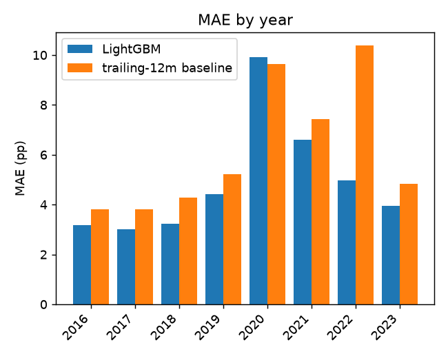

### By Census region

| region | MAE | RMSE | R² | Spearman ρ | bias (pred−actual) | n |
|---|---|---|---|---|---|---|
| Midwest | 4.43 | 6.16 | -0.040 | 0.200 | -1.48 | 247,575 |
| Northeast | 4.56 | 6.63 | -0.090 | 0.323 | -2.54 | 159,236 |
| South | 5.26 | 7.26 | 0.062 | 0.277 | -1.30 | 285,744 |
| West | 5.67 | 7.75 | 0.162 | 0.423 | -0.50 | 133,164 |

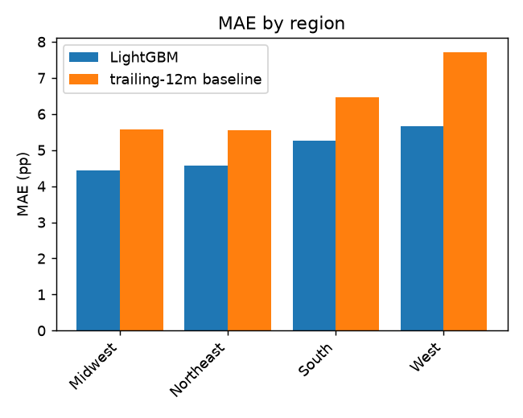

### By metro size

| metro_size_bucket | MAE | RMSE | R² | Spearman ρ | bias (pred−actual) | n |
|---|---|---|---|---|---|---|
| large | 4.60 | 6.55 | 0.119 | 0.382 | -1.30 | 194,416 |
| mega | 4.10 | 5.73 | 0.155 | 0.424 | -0.97 | 131,557 |
| mid | 4.85 | 6.78 | 0.038 | 0.280 | -1.56 | 273,801 |
| non_metro | 6.18 | 8.33 | -0.108 | 0.068 | -2.09 | 143,960 |
| small | 5.23 | 7.15 | 0.046 | 0.224 | -1.22 | 81,985 |

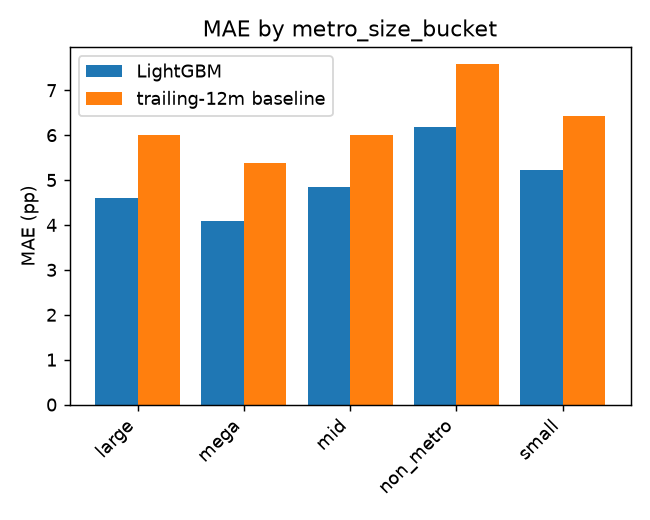

### By price tier (ZHVI quintile within month)

| price_tier | MAE | RMSE | R² | Spearman ρ | bias (pred−actual) | n |
|---|---|---|---|---|---|---|
| bottom 20% | 6.19 | 8.32 | -0.076 | 0.135 | -1.80 | 165,157 |
| 20-40% | 4.82 | 6.56 | -0.016 | 0.215 | -1.48 | 165,130 |
| 40-60% | 4.47 | 6.22 | 0.048 | 0.291 | -1.51 | 165,148 |
| 60-80% | 4.46 | 6.37 | 0.117 | 0.372 | -1.45 | 165,130 |
| top 20% | 4.76 | 6.88 | 0.149 | 0.417 | -1.08 | 165,154 |

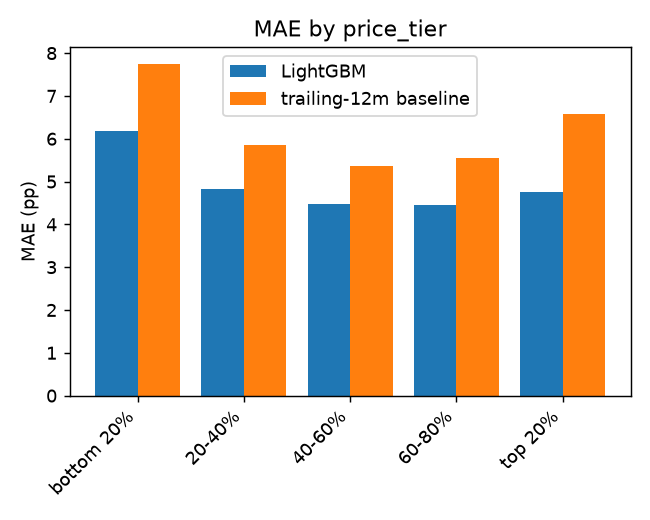

### Decile calibration

| Predicted decile | mean predicted | mean actual | n |
|---|---|---|---|
| 1 | 1.12 | 4.11 | 82,572 |
| 2 | 2.84 | 5.12 | 82,572 |
| 3 | 3.68 | 5.78 | 82,572 |
| 4 | 4.37 | 6.23 | 82,572 |
| 5 | 5.02 | 6.58 | 82,572 |
| 6 | 5.66 | 6.89 | 82,571 |
| 7 | 6.33 | 7.19 | 82,572 |
| 8 | 7.14 | 7.64 | 82,572 |
| 9 | 8.36 | 8.87 | 82,572 |
| 10 | 11.43 | 12.22 | 82,572 |

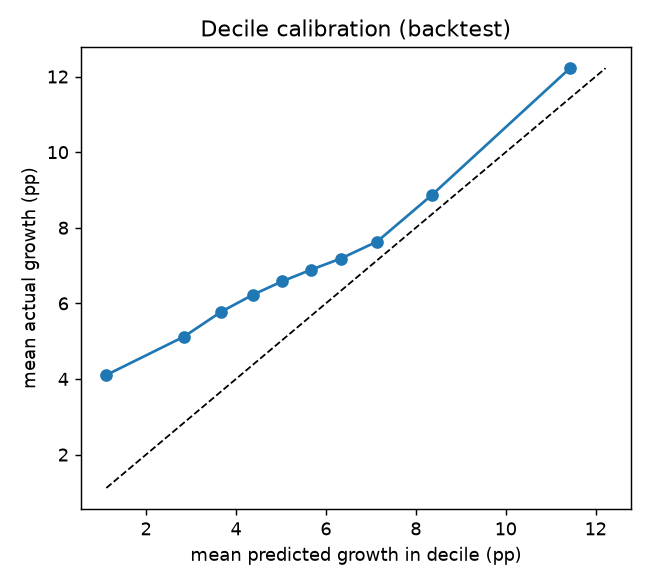

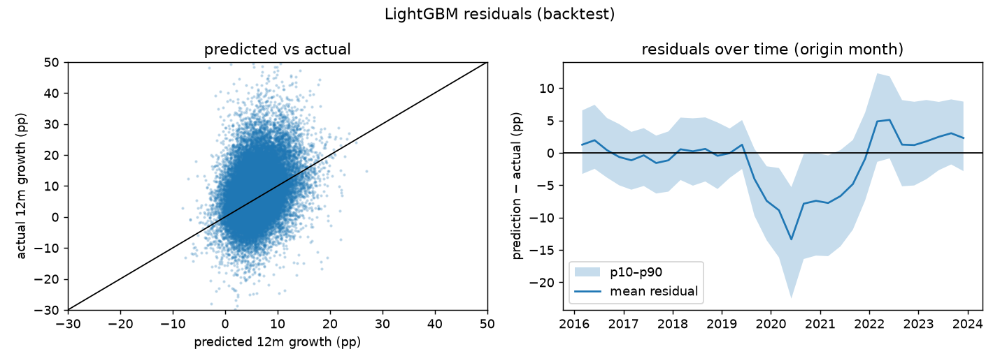

## Error analysis — Holdout (final model)

### By origin year

| year | MAE | RMSE | R² | Spearman ρ | bias (pred−actual) | n |
|---|---|---|---|---|---|---|
| 2024 | 6.45 | 7.91 | -1.653 | 0.064 | 5.97 | 105,070 |
| 2025 | 4.61 | 6.05 | -0.399 | 0.165 | 3.23 | 52,535 |

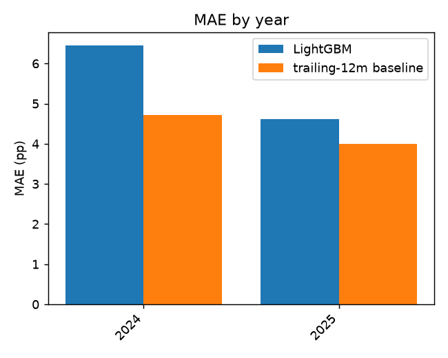

### By Census region

| region | MAE | RMSE | R² | Spearman ρ | bias (pred−actual) | n |
|---|---|---|---|---|---|---|
| Midwest | 4.22 | 5.62 | -0.631 | -0.014 | 2.82 | 47,400 |
| Northeast | 4.76 | 6.01 | -1.400 | -0.036 | 4.03 | 30,311 |
| South | 7.14 | 8.78 | -1.635 | 0.041 | 6.62 | 54,624 |
| West | 7.34 | 8.19 | -3.477 | 0.188 | 7.10 | 25,270 |

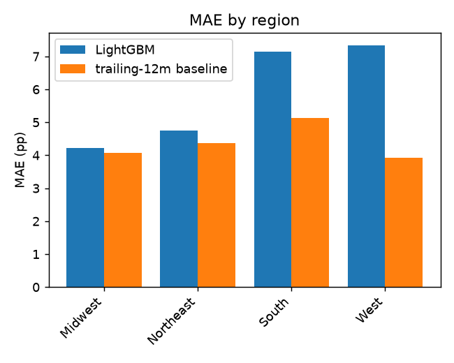

### By metro size

| metro_size_bucket | MAE | RMSE | R² | Spearman ρ | bias (pred−actual) | n |
|---|---|---|---|---|---|---|
| large | 5.85 | 7.06 | -1.797 | 0.135 | 5.47 | 36,646 |
| mega | 5.11 | 6.40 | -1.682 | 0.054 | 4.61 | 24,792 |
| mid | 5.75 | 7.15 | -1.305 | 0.010 | 5.03 | 52,127 |
| non_metro | 6.55 | 8.57 | -0.672 | -0.034 | 4.98 | 28,272 |
| small | 5.94 | 7.60 | -0.963 | 0.042 | 5.04 | 15,768 |

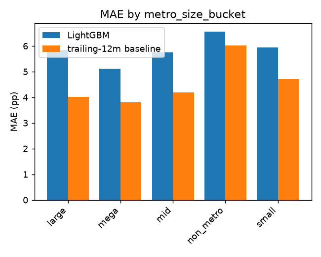

### By price tier (ZHVI quintile within month)

| price_tier | MAE | RMSE | R² | Spearman ρ | bias (pred−actual) | n |
|---|---|---|---|---|---|---|
| bottom 20% | 7.66 | 9.90 | -0.790 | -0.024 | 6.09 | 31,524 |
| 20-40% | 5.24 | 6.68 | -0.865 | -0.007 | 4.14 | 31,518 |
| 40-60% | 5.05 | 6.26 | -1.422 | 0.043 | 4.50 | 31,521 |
| 60-80% | 5.52 | 6.58 | -2.299 | 0.103 | 5.28 | 31,518 |
| top 20% | 5.71 | 6.66 | -2.344 | 0.062 | 5.28 | 31,524 |

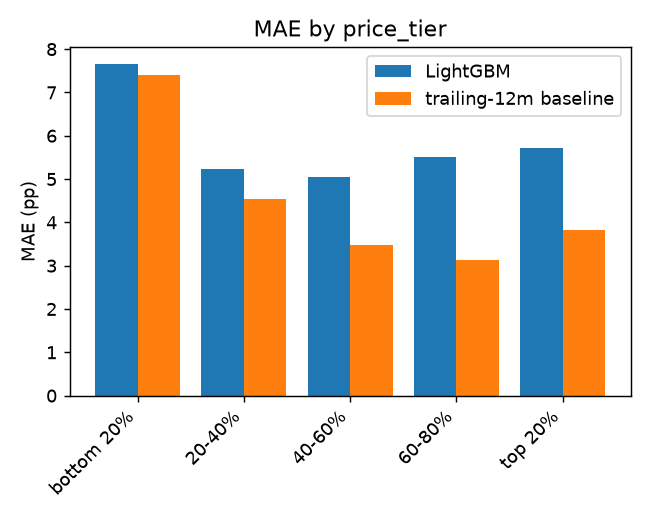

### Decile calibration

| Predicted decile | mean predicted | mean actual | n |
|---|---|---|---|
| 1 | 3.58 | 0.17 | 15,761 |
| 2 | 4.92 | 1.76 | 15,760 |
| 3 | 5.48 | 2.14 | 15,761 |
| 4 | 5.93 | 2.09 | 15,760 |
| 5 | 6.36 | 2.07 | 15,761 |
| 6 | 6.82 | 2.22 | 15,760 |
| 7 | 7.33 | 2.04 | 15,760 |
| 8 | 7.98 | 1.87 | 15,761 |
| 9 | 8.92 | 1.80 | 15,760 |
| 10 | 10.74 | 1.32 | 15,761 |

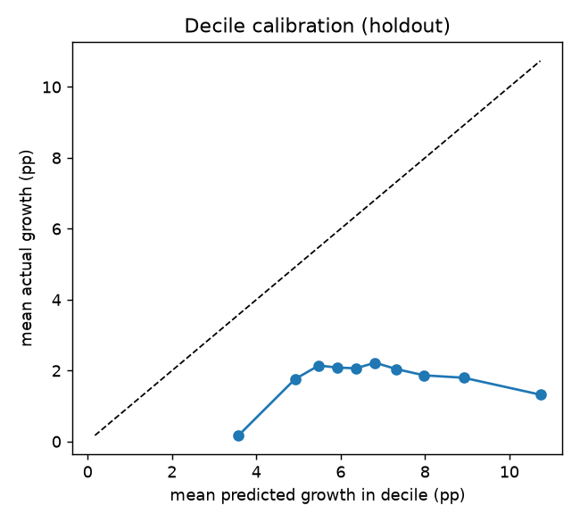

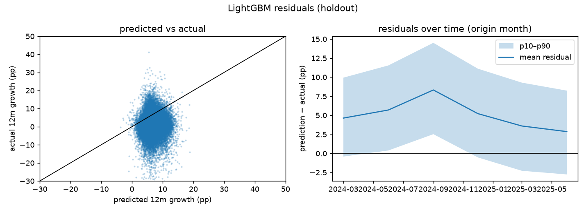

## Explainability (SHAP, final model)

Computed on a seeded sample of 20,000 training rows (2013-03-01 → 2022-12-01).

| Feature | mean \|SHAP\| (pp) |
|---|---|
| mortgage_rate_30y | 1.810 |
| state | 1.012 |
| mortgage_rate_chg_12m | 0.793 |
| growth_12m | 0.580 |
| national_unemployment_chg_12m | 0.503 |
| growth_1m | 0.431 |
| zhvi_rel_metro | 0.351 |
| cpi_yoy | 0.295 |
| national_growth_12m | 0.250 |
| growth_36m | 0.240 |
| zhvi_to_acs_value | 0.208 |
| growth_24m | 0.192 |
| mortgage_rate_chg_3m | 0.168 |
| national_unemployment | 0.164 |
| state_unemployment | 0.128 |

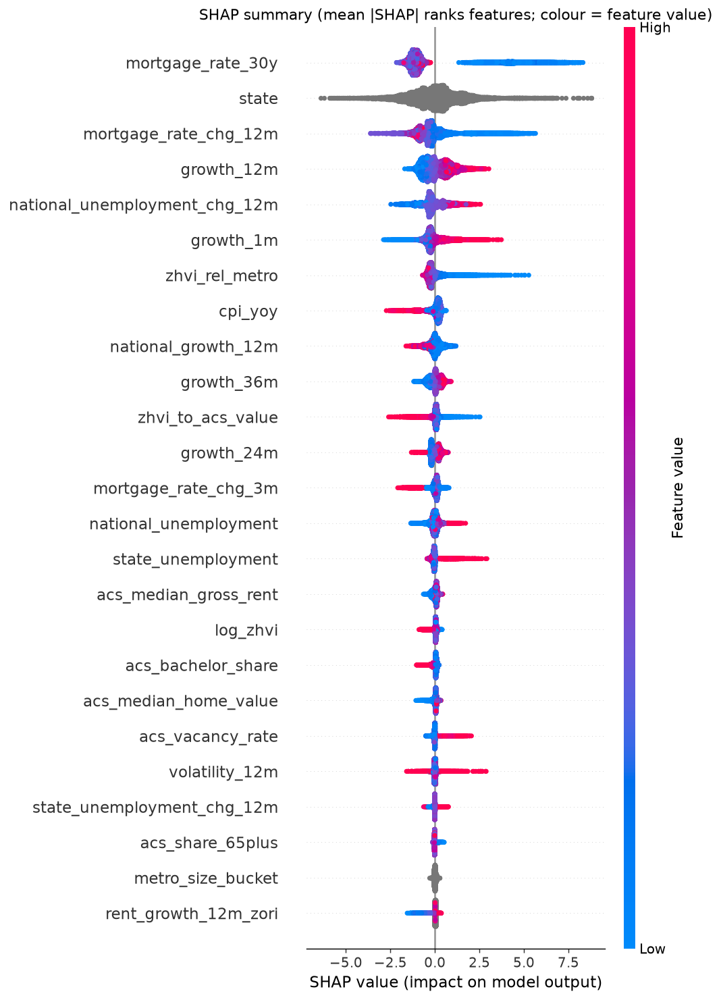

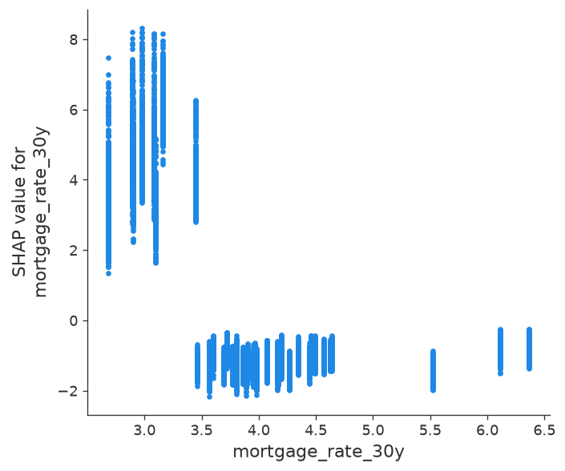
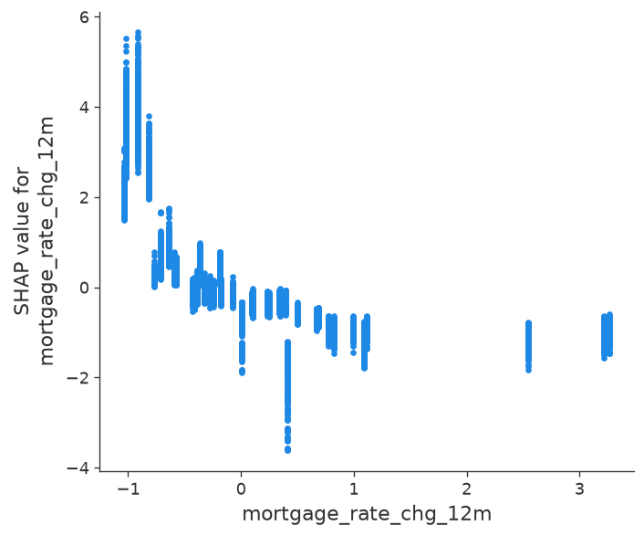
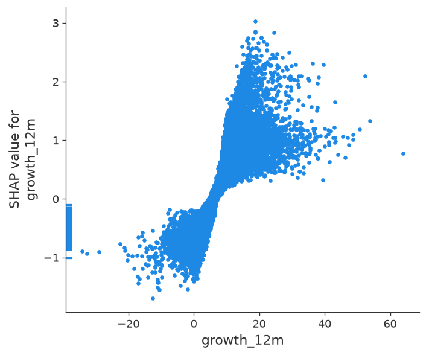
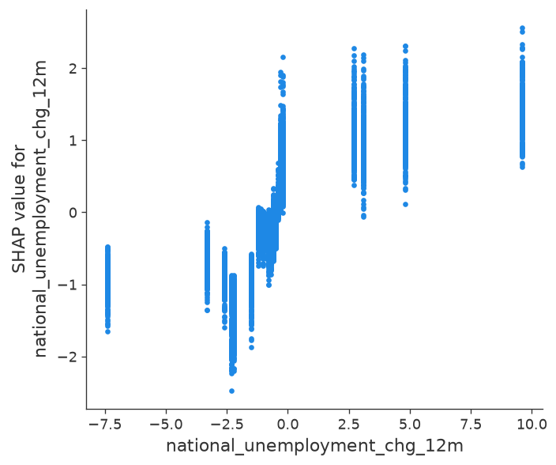
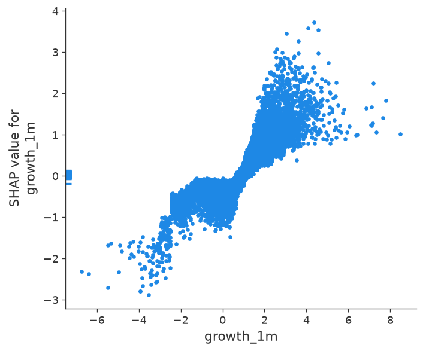
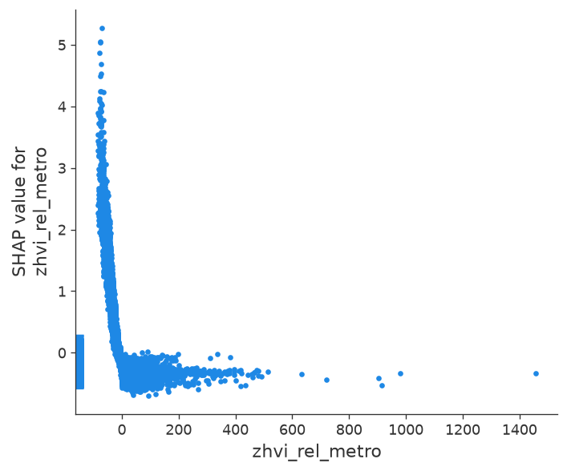

### Local explanations

- ZIP 94110 @ 2022-12-01: predicted -2.99 pp, actual -5.83. Top: cpi_yoy (-2.28), growth_12m (-1.53), growth_1m (-0.95), growth_36m (-0.95)
- ZIP 94110 @ 2025-06-01: predicted 5.43 pp, actual 12.69. Top: national_unemployment_chg_12m (+1.28), state (+1.18), growth_12m (-1.13), mortgage_rate_30y (-0.88)
- ZIP 78702 @ 2022-12-01: predicted -2.88 pp, actual -9.38. Top: cpi_yoy (-1.65), growth_1m (-1.20), state (-1.13), mortgage_rate_chg_12m (-0.91)
- ZIP 78702 @ 2025-06-01: predicted 2.23 pp, actual -4.76. Top: growth_12m (-1.37), rent_growth_12m_zori (-1.21), mortgage_rate_30y (-1.17), national_unemployment_chg_12m (+1.13)
- ZIP 33139 @ 2022-12-01: predicted 4.17 pp, actual 0.10. Top: state (+1.25), cpi_yoy (-1.25), mortgage_rate_30y (-1.13), growth_12m (+1.05)
- ZIP 33139 @ 2025-06-01: predicted 2.36 pp, actual -0.87. Top: mortgage_rate_30y (-1.64), state (+1.28), growth_12m (-1.23), national_unemployment_chg_12m (+1.10)
- ZIP 48226 @ 2022-12-01: predicted -1.48 pp, actual -1.43. Top: cpi_yoy (-1.50), rent_growth_12m_zori (-1.10), growth_12m (-1.06), growth_36m (-0.92)
- ZIP 48226 @ 2025-06-01: predicted 4.31 pp, actual -5.48. Top: national_unemployment_chg_12m (+1.11), mortgage_rate_30y (-1.05), rent_growth_12m_zori (-0.76), growth_36m (-0.57)
- ZIP 10025 @ 2022-12-01: predicted -4.08 pp, actual -5.18. Top: cpi_yoy (-1.68), growth_1m (-1.46), growth_12m (-1.20), growth_36m (-1.15)
- ZIP 10025 @ 2025-06-01: predicted 3.60 pp, actual 1.52. Top: mortgage_rate_30y (-0.97), state (-0.88), growth_36m (-0.84), national_unemployment_chg_12m (+0.73)
- ZIP 85004 @ 2022-12-01: predicted 1.69 pp, actual 2.00. Top: cpi_yoy (-1.45), mortgage_rate_chg_12m (-1.15), mortgage_rate_30y (-0.99), rent_growth_12m_zori (-0.70)
- ZIP 85004 @ 2025-06-01: predicted 3.76 pp, actual -3.01. Top: state (+1.80), national_unemployment_chg_12m (+1.64), mortgage_rate_30y (-1.57), growth_12m (-1.19)

## Discussion

See the *Honest discussion* section appended by the author below (kept separate from generated tables).

### Honest discussion

**The headline result is negative.** On the untouched holdout (origins 2024-03 → 2025-06) the final
LightGBM has MAE 5.84 pp, worse than predicting zero growth (4.02) and worse than "trailing 12-month
growth continues" (4.47). Its predictions are biased upward by about 6 pp: the mean prediction per origin
was 5.7–9.2 % while realised growth was 0.8–2.9 %. Within-origin Spearman is 0.09 — almost no ranking
skill in that period.

**Why.** Three things line up:

1. *Regime extrapolation on macro features.* `mortgage_rate_30y` is the most important feature by mean
   |SHAP|, followed by `mortgage_rate_chg_12m` and `national_unemployment_chg_12m`. The SHAP summary shows
   the pattern the model learned: very low rates (2020–21) → +8 pp. Training ends at origin 2022-12, so the
   model saw exactly one rate cycle, and the holdout sits in a rate regime (6.5–7 %) it had barely seen.
   Tree models cannot extrapolate; they map the holdout onto the nearest leaves of a different regime.
2. *The national component dominates and is unpredictable here.* Year-to-year, realised growth swings
   between −4 % (2010) and +15 % (2020) on average across ZIPs. No model in the backtest beats the
   training-mean baseline by much on MAE in calm years, and all models miss 2020 by ~10 pp. R² is negative
   in most folds for every model because the market-wide level is most of the variance.
3. *Ranking skill decayed before the holdout.* LightGBM's within-origin Spearman was 0.49 / 0.50 / 0.30 in
   2016–18, 0.36 / 0.34 in 2020–21, then 0.06 and 0.08 in 2022–23. The trailing-growth baseline fell
   less (0.08, 0.28). The post-2021 market is less momentum-driven and more rate-driven, and the model
   had no way to learn that.

**What does work.** Over the 8 backtest folds LightGBM and the random forest beat every naive baseline on
MAE (4.9 and 4.8 vs 5.3 for the training mean, 6.2 for trailing growth) and rank ZIPs with a within-origin
Spearman of ≈0.31 on average — real but modest cross-sectional skill, concentrated in 2016–2021.
Momentum (`growth_12m`, `growth_1m`), relative value (`zhvi_rel_metro`) and state are the stable
contributors. The geography ablation hurts (MAE 5.05 without state/region/metro bucket); dropping ACS
demographics changes nothing (4.91), i.e. the slow-moving demographic features add essentially no
12-month signal beyond what momentum and location already carry.

**The no-macro ablation.** Dropping all nine macro series (37 features left) makes the backtest *worse* on average: MAE 5.86 ± 3.27 vs 4.91 ± 2.34 with them, within-origin Spearman 0.30 vs 0.31. The difference is concentrated in 2022 (MAE 11.1 without vs 5.0 with): the rising-rate features let the model anticipate the 2022 slowdown that momentum alone could not. In 2023 the no-macro model ranks slightly better (0.19 vs 0.08). So the macro features carry real signal in-sample, but it is a signal learned from a single cycle, and on the holdout the same features drove the +6 pp bias. That is the central lesson of this project: with ~12 years of history there is one rate cycle to learn from, and any feature that encodes it will look good in a backtest that spans it and fail when the regime moves on.

**Calibration.** On the holdout the decile calibration is flat-to-inverted: the top predicted decile
(mean 10.7 %) realised 1.3 %, the bottom decile (3.6 %) realised 0.2 %. On the backtest folds calibration
is monotone (higher predicted deciles do realise higher growth) but the model under-predicts by 1–3 pp in
every decile — the opposite sign of the holdout bias, which is further evidence that the level is regime noise. Predictions should be read as rankings, not as magnitudes.

**Where the errors are.** Holdout MAE is 4.2 in the Midwest and 4.8 in the Northeast but 7.1 in the South
and 7.3 in the West — the Sun Belt/West markets that boomed in 2020–21 and then stalled are exactly where
the regime-extrapolation bias is largest (+6.6 and +7.1 pp bias). Non-metro ZIPs (MAE 6.2 backtest / 6.6 holdout) and bottom-quintile ZIPs (6.2 / 7.7) have the highest
errors in both periods (see the breakdown tables).

**What I would do next** (not done, to keep the holdout clean):

* Remove or de-emphasise level macro features and keep only cross-sectional ones, or predict
  *relative* growth (ZIP minus national) and leave the national level to a separate, explicitly
  uncertain component.
* Train with sample weights favouring recent origins, or with a rolling (not expanding) window, so the
  2020–21 regime does not dominate.
* Quantile regression / conformal intervals so the demo shows the (wide) uncertainty.
* A longer history (ZHVI goes back to 2000; ACS limits the start to 2013) to see more than one rate cycle —
  possible by letting demographics be missing pre-2013.

**Protocol note.** The holdout was evaluated exactly once with the pre-registered model. Nothing above was
used to change that model. The ablations are backtest-only experiments.
